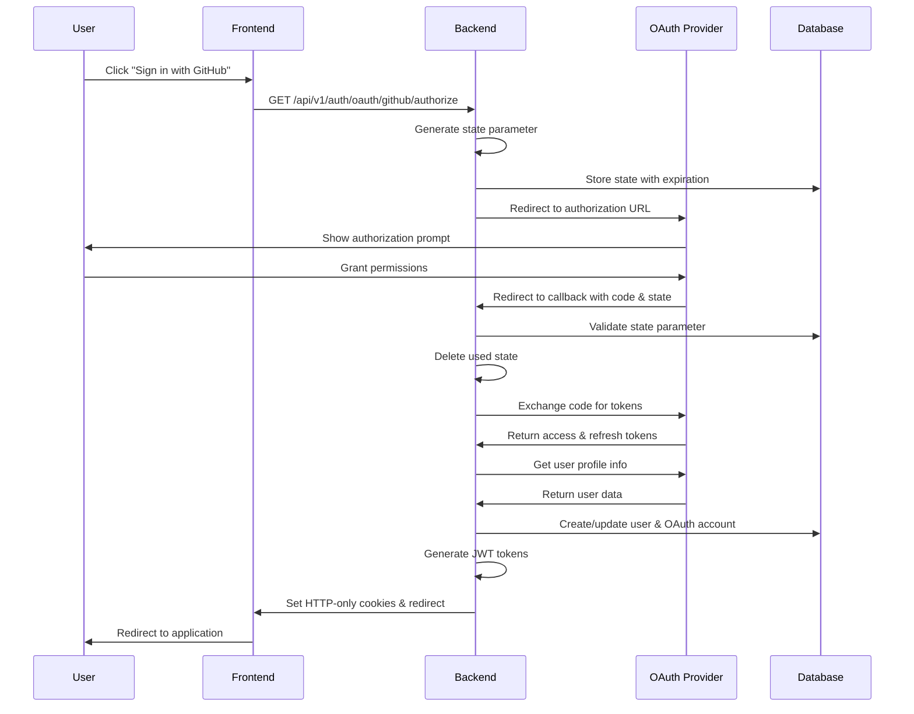
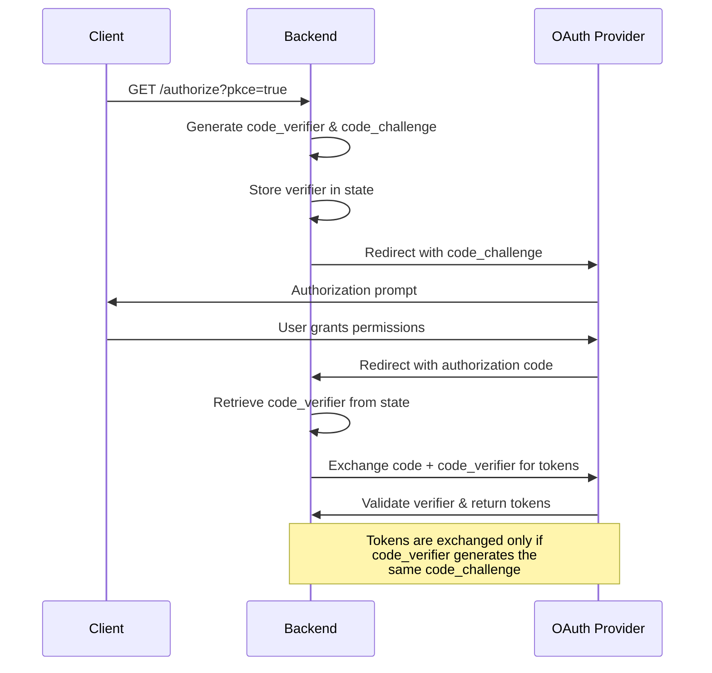

# OAuth 2.0 Flow Documentation - Learning Guide

**Last Updated:** August 9, 2025  
**Application:** Eino Test Application  
**Supported Providers:** GitHub, Google

## Table of Contents
- [Overview](#overview)
- [Architecture Components](#architecture-components)
- [Flow Sequence Diagrams](#flow-sequence-diagrams)
- [Detailed Flow Steps](#detailed-flow-steps)
- [Code Organization](#code-organization)
- [Security Features](#security-features)
- [Configuration Setup](#configuration-setup)
- [API Endpoints](#api-endpoints)
- [Error Handling](#error-handling)
- [Best Practices](#best-practices)
- [Troubleshooting](#troubleshooting)

## Overview

This application implements a secure OAuth 2.0 authentication flow with support for multiple providers (GitHub and Google). The implementation follows security best practices including PKCE support, HTTP-only cookies for token storage, and comprehensive error handling.

### Key Features
- ✅ **Multi-Provider Support**: GitHub and Google OAuth providers
- ✅ **PKCE Support**: Enhanced security for public clients
- ✅ **HTTP-Only Cookies**: Secure token storage
- ✅ **State Validation**: CSRF protection
- ✅ **Account Linking**: Link multiple OAuth accounts to one user
- ✅ **Comprehensive Error Handling**: User-friendly error messages
- ✅ **Token Management**: Access and refresh token handling

## Architecture Components

```
┌─────────────────┐    ┌─────────────────┐    ┌─────────────────┐
│   Frontend      │    │   Backend       │    │  OAuth Provider │
│  (Next.js)      │    │   (Go/Echo)     │    │ (GitHub/Google) │
├─────────────────┤    ├─────────────────┤    ├─────────────────┤
│ • OAuth Client  │◄──►│ • OAuth Handler │◄──►│ • Authorization │
│ • Middleware    │    │ • Auth Service  │    │ • Token Exchange│
│ • Callback Page │    │ • JWT Service   │    │ • User Info     │
│ • Token Utils   │    │ • Database      │    │ • API Endpoints │
└─────────────────┘    └─────────────────┘    └─────────────────┘
```

### Frontend Components (`frontend/`)
- **`lib/auth/oauth.ts`**: OAuth client functions and utilities
- **`app/(auth)/oauth/callback/page.tsx`**: OAuth callback handler
- **`middleware.ts`**: Route protection and authentication middleware
- **`lib/auth/client.ts`**: Authentication API client

### Backend Components (`internal/`)
- **`handlers/oauth_handler.go`**: OAuth flow HTTP handlers
- **`auth/oauth.go`**: OAuth service with provider configurations
- **`auth/auth.go`**: JWT token generation and validation
- **`middleware/auth.go`**: Authentication middleware
- **`repository/oauth_repository.go`**: OAuth data persistence
- **`models/user.go`**: User and OAuth account models

## Flow Sequence Diagrams

### Standard OAuth Flow (Web Application)



### PKCE Flow (Enhanced Security)



## Detailed Flow Steps

### 1. OAuth Initiation

**Frontend (User Action)**
```typescript
// User clicks "Sign in with GitHub"
import { initiateOAuth } from '@/lib/auth/oauth';

const handleGitHubLogin = () => {
  initiateOAuth('github'); // Redirects to backend
};
```

**Backend (Authorization URL Generation)**
```go
// GET /api/v1/auth/oauth/{provider}/authorize
func (h *OAuthHandler) InitiateOAuth(c echo.Context) error {
    // 1. Validate provider is enabled
    // 2. Generate secure state parameter (32 random bytes)
    // 3. Store state in database with 10-minute expiration
    // 4. Generate authorization URL with state
    // 5. Redirect user to OAuth provider
}
```

### 2. User Authorization (OAuth Provider)

The user is redirected to the OAuth provider (GitHub/Google) where they:
1. **View Permission Scope**: See what data the app requests
2. **Grant/Deny Access**: Choose to authorize or cancel
3. **Account Selection** (Google): Choose which account to use

### 3. OAuth Callback Processing

**Provider Redirect**
```
GET /api/v1/auth/oauth/github/callback
    ?code=abc123...
    &state=xyz789...
    &[error=access_denied]
```

**Backend Callback Handler**
```go
func (h *OAuthHandler) HandleOAuthCallback(c echo.Context) error {
    // 1. Extract code, state, and error parameters
    // 2. Handle OAuth provider errors
    // 3. Validate state parameter against stored value
    // 4. Exchange authorization code for access token
    // 5. Fetch user profile from provider API
    // 6. Create or link user account
    // 7. Generate JWT tokens
    // 8. Set secure HTTP-only cookies
    // 9. Redirect to frontend success page
}
```

### 4. Token Exchange and User Data

**Token Exchange**
```go
// Exchange code for tokens
token, err := h.oauthSvc.ExchangeCode(ctx, provider, code, opts...)

// Tokens received:
// - access_token: For API calls
// - refresh_token: For token renewal
// - expires_in: Token lifetime
// - token_type: Usually "Bearer"
```

**User Data Fetching**
```go
// GitHub API call
GET https://api.github.com/user
Authorization: Bearer {access_token}

// Google API call  
GET https://www.googleapis.com/oauth2/v2/userinfo
Authorization: Bearer {access_token}
```

### 5. User Account Management

**New User Creation**
```go
// Create user account
user := &models.User{
    Username:        sanitizedUsername,
    Email:           userInfo.Email,
    OAuthProvider:   &provider,
    OAuthProviderID: &userInfo.ID,
    AvatarURL:       &userInfo.AvatarURL,
}

// Create OAuth account link
oauthAccount := &models.OAuthAccount{
    UserID:            user.ID,
    Provider:          provider,
    ProviderAccountID: userInfo.ID,
    AccessToken:       &token.AccessToken,
    RefreshToken:      &token.RefreshToken,
    // ... other fields
}
```

**Existing User Login**
```go
// Find existing OAuth account
oauthAccount, err := h.oauthRepo.GetByProviderID(ctx, provider, userInfo.ID)

// Update tokens
oauthAccount.AccessToken = &token.AccessToken
oauthAccount.RefreshToken = &token.RefreshToken
oauthAccount.TokenExpiresAt = &token.Expiry
```

### 6. JWT Token Generation

```go
// Generate application JWT tokens
accessToken, err := h.authSvc.GenerateAccessToken(user.ID, user.Username)
refreshToken, err := h.authSvc.GenerateRefreshToken()

// Store refresh token in database
refreshTokenRecord := h.authSvc.CreateRefreshTokenRecord(user.ID, refreshToken)
```

### 7. Secure Cookie Storage

```go
// Set HTTP-only secure cookies
c.SetCookie(&http.Cookie{
    Name:     "access_token",
    Value:    accessToken,
    HttpOnly: true,        // Prevents XSS attacks
    Secure:   true,        // HTTPS only
    SameSite: http.SameSiteLaxMode, // CSRF protection
    MaxAge:   15 * 60,     // 15 minutes
})

c.SetCookie(&http.Cookie{
    Name:     "refresh_token", 
    Value:    refreshToken,
    HttpOnly: true,
    Secure:   true,
    SameSite: http.SameSiteLaxMode,
    MaxAge:   7 * 24 * 60 * 60, // 7 days
})
```

### 8. Frontend Callback Handling

```typescript
// OAuth callback page processes the result
export default function OAuthCallbackPage() {
  useEffect(() => {
    const handleCallback = async () => {
      // Check for OAuth errors
      const error = searchParams.get('error');
      if (error) {
        // Display error and redirect to sign-in
        return;
      }

      // Check for success
      const success = searchParams.get('success');
      if (success === 'true') {
        // Tokens are in HTTP-only cookies
        // Middleware will detect authentication
        router.replace('/'); // Redirect to home
      }
    };
  }, []);
}
```

## Code Organization

### Frontend Structure
```
frontend/
├── lib/auth/
│   ├── oauth.ts           # OAuth client functions
│   ├── client.ts          # API client with auth
│   ├── token-utils.ts     # Token validation utilities
│   └── config.ts          # Auth configuration
├── app/(auth)/
│   ├── sign-in/page.tsx   # Sign-in page with OAuth buttons
│   ├── sign-up/page.tsx   # Sign-up page
│   └── oauth/callback/page.tsx # OAuth callback handler
├── middleware.ts          # Route protection
└── types/
    └── authentication.ts  # TypeScript interfaces
```

### Backend Structure
```
internal/
├── handlers/
│   ├── oauth_handler.go   # OAuth HTTP handlers
│   └── auth_handler.go    # Regular auth handlers
├── auth/
│   ├── oauth.go           # OAuth service
│   └── auth.go            # JWT auth service
├── middleware/
│   └── auth.go            # Authentication middleware
├── repository/
│   ├── oauth_repository.go # OAuth data access
│   └── user_repository.go  # User data access
├── models/
│   └── user.go            # User & OAuth models
└── database/
    └── database.go        # Database connection
```

## Security Features

### 1. State Parameter Protection (CSRF)
```go
// Generate cryptographically secure state
func (s *OAuthService) GenerateState() (string, error) {
    b := make([]byte, 32)
    if _, err := rand.Read(b); err != nil {
        return "", err
    }
    return base64.URLEncoding.EncodeToString(b), nil
}

// Store in database with expiration
oauthState := &models.OAuthState{
    State:     state,
    Provider:  provider,
    ExpiresAt: time.Now().Add(10 * time.Minute),
}
```

### 2. PKCE (Proof Key for Code Exchange)
```go
// Generate code verifier and challenge
func (s *OAuthService) GeneratePKCE() (verifier, challenge string, err error) {
    // 32-byte random verifier
    b := make([]byte, 32)
    rand.Read(b)
    verifier = base64.URLEncoding.WithPadding(base64.NoPadding).EncodeToString(b)
    
    // SHA256 challenge
    h := sha256.New()
    h.Write([]byte(verifier))
    challenge = base64.URLEncoding.WithPadding(base64.NoPadding).EncodeToString(h.Sum(nil))
    
    return verifier, challenge, nil
}
```

### 3. HTTP-Only Secure Cookies
```go
// Prevent XSS and CSRF attacks
cookie := &http.Cookie{
    Name:     "access_token",
    Value:    token,
    HttpOnly: true,                    // No JavaScript access
    Secure:   true,                    // HTTPS only
    SameSite: http.SameSiteLaxMode,    // CSRF protection
    Path:     "/",                     // Cookie scope
    MaxAge:   15 * 60,                 // 15 minutes
}
```

### 4. Input Validation and Sanitization
```go
// Sanitize OAuth user data
userInfo.ID = strings.TrimSpace(userInfo.ID)
userInfo.Email = strings.TrimSpace(strings.ToLower(userInfo.Email))
userInfo.Username = strings.TrimSpace(userInfo.Username)

// Validate email format
emailRegex := regexp.MustCompile(`^[a-zA-Z0-9._%+\-]+@[a-zA-Z0-9.\-]+\.[a-zA-Z]{2,}$`)
if userInfo.Email != "" && !emailRegex.MatchString(userInfo.Email) {
    userInfo.Email = "" // Clear invalid email
}
```

### 5. JWT Token Security
```go
// Generate tokens with proper expiration
accessToken := jwt.NewWithClaims(jwt.SigningMethodHS256, jwt.MapClaims{
    "user_id":  userID,
    "username": username,
    "exp":      time.Now().Add(15 * time.Minute).Unix(),
    "iat":      time.Now().Unix(),
    "iss":      "eino-agent",
})
```

## Configuration Setup

### Environment Variables

**Required OAuth Settings**
```bash
# GitHub OAuth
GITHUB_CLIENT_ID=your_github_client_id
GITHUB_CLIENT_SECRET=your_github_client_secret
GITHUB_REDIRECT_URL=http://localhost:8080/api/v1/auth/oauth/github/callback

# Google OAuth  
GOOGLE_CLIENT_ID=your_google_client_id
GOOGLE_CLIENT_SECRET=your_google_client_secret
GOOGLE_REDIRECT_URL=http://localhost:8080/api/v1/auth/oauth/google/callback

# Security
JWT_ACCESS_SECRET=your-256-bit-secret-key
JWT_REFRESH_SECRET=your-256-bit-refresh-secret-key
OAUTH_STATE_SECRET=your-oauth-state-secret-32-bytes

# Application URLs
FRONTEND_URL=http://localhost:3000
```

### OAuth App Configuration

**GitHub OAuth App Setup**
1. Go to GitHub Settings → Developer settings → OAuth Apps
2. Create new OAuth App with:
   - **Application name**: Your app name
   - **Homepage URL**: `http://localhost:3000`
   - **Authorization callback URL**: `http://localhost:8080/api/v1/auth/oauth/github/callback`
3. Copy Client ID and Client Secret to environment variables

**Google OAuth App Setup**
1. Go to Google Cloud Console → APIs & Services → Credentials
2. Create OAuth 2.0 Client ID with:
   - **Application type**: Web application
   - **Authorized redirect URIs**: `http://localhost:8080/api/v1/auth/oauth/google/callback`
3. Copy Client ID and Client Secret to environment variables

### Database Schema

**Users Table**
```sql
CREATE TABLE users (
    id UUID PRIMARY KEY DEFAULT gen_random_uuid(),
    username VARCHAR(255) UNIQUE NOT NULL,
    email VARCHAR(255) UNIQUE,
    password_hash VARCHAR(255),
    oauth_provider VARCHAR(50),
    oauth_provider_id VARCHAR(255),
    avatar_url TEXT,
    oauth_email VARCHAR(255),
    created_at TIMESTAMP DEFAULT CURRENT_TIMESTAMP,
    updated_at TIMESTAMP DEFAULT CURRENT_TIMESTAMP
);
```

**OAuth Accounts Table**
```sql
CREATE TABLE oauth_accounts (
    id UUID PRIMARY KEY DEFAULT gen_random_uuid(),
    user_id UUID NOT NULL REFERENCES users(id) ON DELETE CASCADE,
    provider VARCHAR(50) NOT NULL,
    provider_account_id VARCHAR(255) NOT NULL,
    provider_email VARCHAR(255),
    provider_username VARCHAR(255),
    provider_avatar_url TEXT,
    access_token TEXT,
    refresh_token TEXT,
    token_expires_at TIMESTAMP,
    raw_user_data JSONB,
    created_at TIMESTAMP DEFAULT CURRENT_TIMESTAMP,
    updated_at TIMESTAMP DEFAULT CURRENT_TIMESTAMP,
    
    UNIQUE(provider, provider_account_id)
);
```

**OAuth States Table**
```sql
CREATE TABLE oauth_states (
    state VARCHAR(255) PRIMARY KEY,
    provider VARCHAR(50) NOT NULL,
    redirect_uri VARCHAR(255),
    code_verifier VARCHAR(255),
    expires_at TIMESTAMP NOT NULL,
    created_at TIMESTAMP DEFAULT CURRENT_TIMESTAMP
);
```

## API Endpoints

### OAuth Flow Endpoints

| Method | Endpoint | Description | Parameters |
|--------|----------|-------------|------------|
| `GET` | `/api/v1/auth/oauth/providers` | Get enabled providers | None |
| `GET` | `/api/v1/auth/oauth/{provider}/authorize` | Initiate OAuth flow | `provider`, `?pkce=true`, `?redirect=false` |
| `GET` | `/api/v1/auth/oauth/{provider}/callback` | Handle OAuth callback | `code`, `state`, `?error` |
| `GET` | `/api/v1/auth/oauth/{provider}/link` | Link OAuth account | `provider` (requires auth) |
| `DELETE` | `/api/v1/auth/oauth/{provider}/unlink` | Unlink OAuth account | `provider` (requires auth) |
| `GET` | `/api/v1/auth/oauth/linked` | Get linked accounts | None (requires auth) |

### Authentication Endpoints

| Method | Endpoint | Description |
|--------|----------|-------------|
| `POST` | `/api/auth/validate` | Validate JWT token |
| `POST` | `/api/auth/logout` | Logout user |
| `POST` | `/api/v1/auth/refresh` | Refresh access token |

### Example API Calls

**Get OAuth Providers**
```bash
curl -X GET http://localhost:8080/api/v1/auth/oauth/providers
# Response: {"providers": ["github", "google"]}
```

**Initiate OAuth Flow**
```bash
# Direct redirect (web flow)
curl -X GET http://localhost:8080/api/v1/auth/oauth/github/authorize

# Get URL (API flow)
curl -X GET "http://localhost:8080/api/v1/auth/oauth/github/authorize?redirect=false"
# Response: {"auth_url": "https://github.com/login/oauth/authorize?...", "state": "..."}
```

**PKCE Flow**
```bash
curl -X GET "http://localhost:8080/api/v1/auth/oauth/github/authorize?pkce=true&redirect=false"
# Response includes code_challenge in auth_url
```

## Error Handling

### OAuth Provider Errors

**Common OAuth Errors**
- `access_denied`: User denied permission
- `invalid_request`: Malformed request
- `unauthorized_client`: Invalid client credentials
- `unsupported_response_type`: Unsupported response type
- `invalid_scope`: Invalid scope requested
- `server_error`: Provider server error
- `temporarily_unavailable`: Provider temporarily unavailable

**Error Handling Flow**
```go
// Check for OAuth provider errors
errorParam := c.QueryParam("error")
if errorParam != "" {
    errorDesc := c.QueryParam("error_description")
    redirectURL := fmt.Sprintf("%s/sign-in?error=%s&error_description=%s",
        h.frontendURL, errorParam, errorDesc)
    return c.Redirect(http.StatusTemporaryRedirect, redirectURL)
}
```

### Application Error Scenarios

**State Validation Errors**
```go
// Invalid or missing state
if state == "" {
    redirectURL := fmt.Sprintf("%s/sign-in?error=invalid_state", h.frontendURL)
    return c.Redirect(http.StatusTemporaryRedirect, redirectURL)
}

// Expired state  
if time.Now().After(storedState.ExpiresAt) {
    redirectURL := fmt.Sprintf("%s/sign-in?error=state_expired", h.frontendURL)
    return c.Redirect(http.StatusTemporaryRedirect, redirectURL)
}
```

**Token Exchange Errors**
```go
token, err := h.oauthSvc.ExchangeCode(ctx, provider, code)
if err != nil {
    redirectURL := fmt.Sprintf("%s/sign-in?error=token_exchange_failed", h.frontendURL)
    return c.Redirect(http.StatusTemporaryRedirect, redirectURL)
}
```

**User Info Errors**
```go
userInfo, err := h.oauthSvc.GetUserInfo(ctx, provider, token)
if err != nil {
    redirectURL := fmt.Sprintf("%s/sign-in?error=user_info_failed", h.frontendURL)
    return c.Redirect(http.StatusTemporaryRedirect, redirectURL)
}
```

### Frontend Error Display

```typescript
// OAuth callback error handling
const error = searchParams.get('error');
if (error) {
    const errorDescription = searchParams.get('error_description') || 'OAuth authentication failed';
    setError(errorDescription);
    
    // Redirect to sign-in with error context
    setTimeout(() => {
        router.push(`/sign-in?error=${encodeURIComponent(errorDescription)}`);
    }, 3000);
}
```

## Best Practices

### Security Best Practices

1. **Always Use HTTPS in Production**
   ```go
   // Set secure cookie flag
   cookie.Secure = true // Only works with HTTPS
   ```

2. **Implement Proper CORS**
   ```go
   // Don't use wildcard in production
   c.Response().Header().Set("Access-Control-Allow-Origin", "https://yourdomain.com")
   ```

3. **Use Strong Secrets**
   ```bash
   # Generate secure secrets
   openssl rand -base64 32  # For JWT secrets
   openssl rand -base64 24  # For state secrets
   ```

4. **Implement Rate Limiting**
   ```go
   // Add rate limiting middleware for OAuth endpoints
   middleware.RateLimiter(middleware.RateLimiterConfig{
       Max:        10,
       Expiration: 60 * time.Second,
   })
   ```

5. **Validate All Input**
   ```go
   // Always sanitize and validate user input
   email = strings.TrimSpace(strings.ToLower(email))
   if !emailRegex.MatchString(email) {
       return errors.New("invalid email format")
   }
   ```

### Development Best Practices

1. **Environment Configuration**
   ```bash
   # Use different configs for development/production
   ENV=development  # or production
   ```

2. **Comprehensive Logging**
   ```go
   log.Debug().
       Str("provider", provider).
       Str("user_id", userID).
       Msg("OAuth flow completed successfully")
   ```

3. **Error Recovery**
   ```go
   // Always provide fallback mechanisms
   if username == "" {
       username = fmt.Sprintf("%s_user_%d", provider, time.Now().Unix()%10000)
   }
   ```

4. **Database Transactions**
   ```go
   // Use transactions for atomic operations
   tx, err := db.BeginTx(ctx, nil)
   defer tx.Rollback() // Rollback on error
   
   // Create user and OAuth account atomically
   if err := createUser(tx, user); err != nil {
       return err
   }
   if err := createOAuthAccount(tx, oauthAccount); err != nil {
       return err
   }
   
   return tx.Commit()
   ```

## Troubleshooting

### Common Issues and Solutions

**1. "Invalid State Parameter"**
```
Problem: State validation fails
Causes:
- State expired (>10 minutes)
- Database connection issues
- State not properly stored

Solution:
- Check database connectivity
- Verify state storage logic
- Ensure proper state generation
```

**2. "Token Exchange Failed"**
```
Problem: Cannot exchange authorization code for tokens
Causes:
- Invalid OAuth app configuration
- Incorrect redirect URI
- Expired authorization code
- Network connectivity issues

Solution:
- Verify OAuth app settings
- Check redirect URI matches exactly
- Ensure proper HTTPS configuration
```

**3. "User Info Failed"**
```
Problem: Cannot fetch user profile from provider
Causes:
- Invalid access token
- Insufficient OAuth scopes
- Provider API issues

Solution:
- Check OAuth scopes configuration
- Verify token validity
- Check provider API status
```

**4. "CORS Issues"**
```
Problem: Frontend cannot make requests to backend
Causes:
- Incorrect CORS configuration
- Different ports/domains
- Missing preflight handling

Solution:
- Configure proper CORS origins
- Handle OPTIONS requests
- Check browser developer tools
```

**5. "Cookie Not Set"**
```
Problem: Authentication cookies not being stored
Causes:
- HTTP vs HTTPS mismatch
- Incorrect SameSite setting
- Domain mismatch

Solution:
- Use HTTPS in production
- Adjust SameSite policy for development
- Verify cookie domain settings
```

### Debugging Tips

**1. Enable Debug Logging**
```bash
LOG_LEVEL=debug
```

**2. Check Network Requests**
```javascript
// Browser Developer Tools → Network tab
// Look for:
// - OAuth authorization redirects
// - Token exchange requests  
// - User info API calls
// - Cookie setting responses
```

**3. Verify OAuth App Configuration**
```bash
# Test OAuth app settings
curl -X POST https://github.com/login/oauth/access_token \
  -H "Accept: application/json" \
  -d "client_id=your_client_id" \
  -d "client_secret=your_client_secret" \
  -d "code=your_test_code"
```

**4. Database State Inspection**
```sql
-- Check OAuth states
SELECT * FROM oauth_states WHERE expires_at > NOW();

-- Check OAuth accounts
SELECT * FROM oauth_accounts WHERE provider = 'github';

-- Check users
SELECT * FROM users WHERE oauth_provider IS NOT NULL;
```

**5. Cookie Debugging**
```javascript
// Browser Developer Tools → Application → Cookies
// Verify:
// - access_token cookie exists
// - HttpOnly flag is set
// - Secure flag (production)
// - Correct expiration time
```

### Testing OAuth Flow

**1. Manual Testing Steps**
```bash
# 1. Start the application
make dev

# 2. Navigate to sign-in page
open http://localhost:3000/sign-in

# 3. Click OAuth provider button
# 4. Authorize on provider site
# 5. Verify redirect to application
# 6. Check authentication status
```

**2. Automated Testing**
```bash
# Test OAuth endpoints
./scripts/test-api.sh oauth

# Run integration tests
go test ./internal/handlers -v -run TestOAuth
```

**3. Provider-Specific Testing**

**GitHub Testing**
```bash
# Test GitHub OAuth flow
curl -v "http://localhost:8080/api/v1/auth/oauth/github/authorize"
```

**Google Testing**  
```bash
# Test Google OAuth flow
curl -v "http://localhost:8080/api/v1/auth/oauth/google/authorize"
```

---

## Summary

This OAuth 2.0 implementation provides a secure, scalable foundation for multi-provider authentication. The architecture separates concerns properly between frontend and backend, implements security best practices, and provides comprehensive error handling.

**Key Takeaways:**
- **Security First**: State validation, PKCE, HTTP-only cookies, input sanitization
- **User Experience**: Clear error messages, smooth redirects, progress indicators
- **Maintainability**: Clean code organization, comprehensive logging, proper error handling
- **Scalability**: Database-backed state management, token refresh, account linking

For production deployment, ensure all security configurations are properly set, secrets are securely managed, and monitoring is in place for OAuth flow metrics and errors.